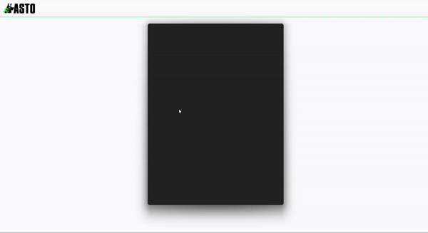
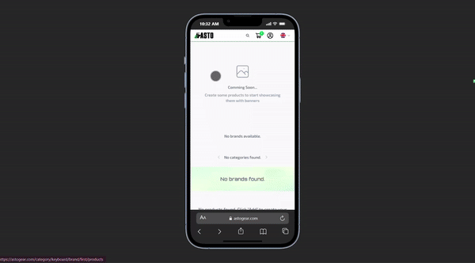
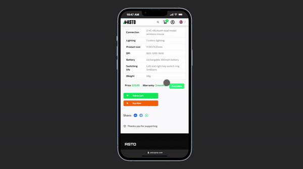
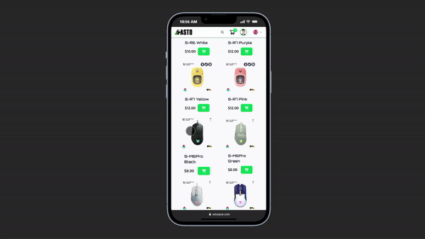
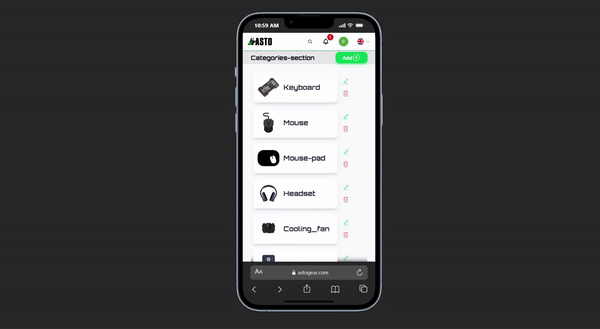
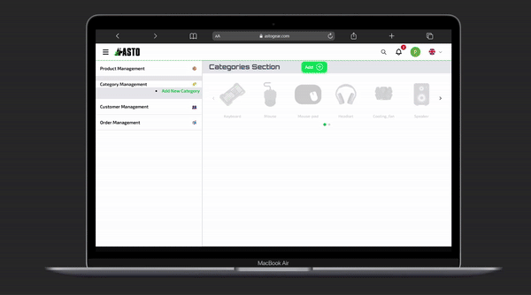

# Asto Gear - Computer Accessories E-commerce Platform

## 📺 Demo

### 🔐 Authentication

### 🏠 Homepage & Product Browsing

### 🛍️ Product Details

### 🛒 Shopping Cart & Checkout

### 💳 Payment Integration

### 🔔 Real-time Notifications

### 👨‍💼 Seller Dashboard

---

## Project Overview

**Asto Gear** is a full-stack e-commerce web application that allows users to build and purchase computer accessories with ease. The platform features real-time notifications, multi-language support, and integrated payment through Bakong API. All orders come with **free delivery** for users.

---

## Key Features

### Authentication
- User registration and login (manual or Google OAuth)
- JWT-based authentication with cookies and authorization headers
- Secure session management

### E-commerce Functionality
- Browse computer accessories and components
- Search products by name
- Filter products by brand and category
- Add products to shopping cart
- View order receipts

### Seller Dashboard
- Full CRUD operations for products, brands, and categories
- Track user login/signup activity
- Manage product inventory

### Real-time Features
- WebSocket notifications for order updates
- Live order tracking

### Payment Integration
- Bakong KHQR payment gateway
- Secure payment processing

### Multi-language Support
- Language options: Khmer, Chinese, English
- Flag-based language switcher

### Delivery Management
- User input for phone number and address
- Multiple delivery provider options:
  - JNT Express
  - Vireak Buntham
  - Grab

### Contact & Support
- About Us page
- Contact via Telegram, Facebook, and Instagram

---

## Tech Stack

### Backend
- **Node.js** & **Express.js** - Server framework
- **MySQL** - Relational database
- **Sequelize** - ORM for database management
- **Firebase** - Authentication services
- **WebSocket** - Real-time communication
- **Nodemailer** - Email notifications
- **Bakong API** - Payment integration
- **JWT** - Token-based authentication
- **Cloudinary** - Image storage and optimization

### Frontend
- **React** with **Vite** - Fast development environment
- **Tailwind CSS** - Utility-first styling
- **Socket.io** - WebSocket client
- **React Toast** - User notifications

### DevOps
- **Docker** & **Docker Compose** - Containerization
- **Nginx** - Reverse proxy and static file serving

---

## 📹 Full Demo Video

[Watch the complete walkthrough on YouTube](https://www.youtube.com/watch?v=LKBMF5jg0k8)

---

## Contact

For any inquiries or support, reach out via:
- **Telegram:** [@Reajasey](https://t.me/Reajasey)
- **Facebook:** [Pisey Khenchandara](https://www.facebook.com/pisey.khenchandara)

---

## Acknowledgments

- Bakong API for payment integration
- Cloudinary for image management
- Firebase for authentication services
- All open-source libraries used in this project

---

## License

This project is for showcase purposes. All rights reserved.